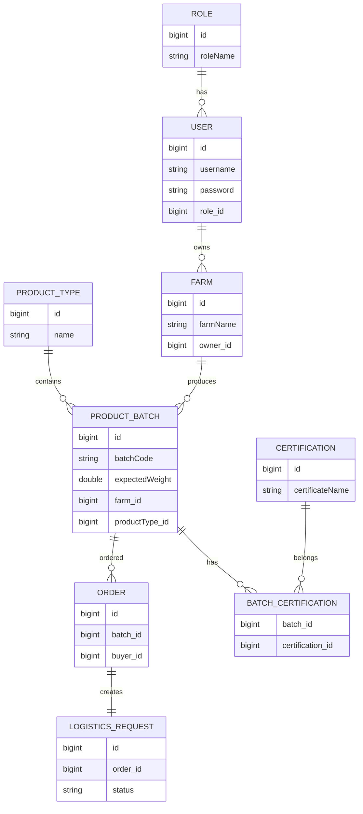

# Mermaid ERD

```mermaid
erDiagram

ROLE ||--o{ USER : has

USER ||--o{ FARM : owns

PRODUCT_TYPE ||--o{ PRODUCT_BATCH : contains

FARM ||--o{ PRODUCT_BATCH : produces

PRODUCT_BATCH ||--o{ ORDER : ordered

ORDER ||--|| LOGISTICS_REQUEST : creates

PRODUCT_BATCH ||--o{ BATCH_CERTIFICATION : has

CERTIFICATION ||--o{ BATCH_CERTIFICATION : belongs

ROLE {
    bigint id
    string roleName
}

USER {
    bigint id
    string username
    string password
    bigint role_id
}

FARM {
    bigint id
    string farmName
    bigint owner_id
}

PRODUCT_TYPE {
    bigint id
    string name
}

PRODUCT_BATCH {
    bigint id
    string batchCode
    double expectedWeight
    bigint farm_id
    bigint productType_id
}

CERTIFICATION {
    bigint id
    string certificateName
}

BATCH_CERTIFICATION {
    bigint batch_id
    bigint certification_id
}

ORDER {
    bigint id
    bigint batch_id
    bigint buyer_id
}

LOGISTICS_REQUEST {
    bigint id
    bigint order_id
    string status
}
```